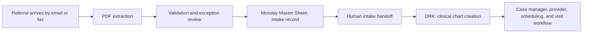

# WCW Automation Integration Brief

## Purpose

Define a safe, staged path for turning incoming referral PDFs into usable operational work for West Coast Wound (WCW), without automating decisions that still belong to intake staff, case managers, or the EHR workflow.

This brief connects the current PDF extractor, WCW's Monday.com Master Sheet, the documented referral-to-visit workflow, and DRK, where clinical charts are built.

## Target Outcome

When a referral PDF arrives, the system should extract the required intake facts, make uncertainty visible, and place the referral into the correct operational queue. The team should spend time validating exceptions and completing clinical/operational decisions, rather than retyping routine information.

## What We Know Today

- The PDF extractor can return patient identity and contact details, referral details, insurance, requested services, diagnosis text, and supporting notes.
- The Master Sheet is a large live operational board with 18,088 accessible records and 124 columns. It is not a clean intake-only database.
- `Stage` is almost always `In intake`, including for patients who were already seen, placed on hold, or discharged. It should be treated as an intake marker, not as the historical lifecycle source of truth.
- `Visit Status` appears to hold the useful operating lifecycle, including scheduled, seen, holds, and discharge-related states.
- The Master Sheet includes human-owned handoff, scheduling, provider, QA, hold, and discharge fields. Those should not be set automatically by the first version.
- DRK is the system where actual clinical charts are built. Its data model, API/import options, source-of-truth role, and ownership are not yet confirmed.

## Proposed V1: Assisted Intake, Not Full Workflow Automation

V1 should automate only the repetitive front of the workflow.

1. Receive a referral PDF from the agreed source mailbox or folder.
2. Extract agreed intake fields and retain the source PDF reference.
3. Apply local validation rules and flag missing or ambiguous fields for a human.
4. Create a Master Sheet item in `Working pipeline` using only approved intake columns.
5. Mark the item for human intake review or follow the agreed intake assignment rule.
6. Leave all downstream work to WCW staff until the ownership and DRK integration are confirmed.

This is intentionally conservative. A successful extraction does not prove that the referral is clinically complete, schedulable, accepted by the source, assigned to a case manager, or ready for a DRK chart.

## Monday.com Boundary

### Candidate fields for initial PDF intake

- Referral/patient name
- Patient date of birth
- Referral received date and time
- Point of service, when confidently available
- Agency contact, phone, and email
- Any additional patient contact/address fields only after WCW confirms which current columns are authoritative
- Initial intake marker (`Stage = In intake`) if WCW confirms that convention

### Fields V1 must not write

- Case manager assignment
- Sent-to-CM and sent-to-Nexus confirmations/timestamps
- Provider selection or provider relations
- Appointment/scheduling completion
- Visit, hold, QA, discharge, and follow-up statuses
- Formula, mirror, and relation fields without a defined lookup/matching rule

### Current mapping gaps

The Master Sheet has no obvious dedicated destination for the following extraction outputs:

- Diagnosis text and ICD-10 codes
- Insurance provider, member ID, and group number
- Requested services and frequency/instructions
- Original PDF attachment or durable source-file reference

These fields must have a confirmed destination in Monday, DRK, or both before production use. Dropping them would make the automation incomplete.

## DRK Boundary to Confirm

DRK may be the clinical record of truth while Monday is the operational coordination layer. Before integrating DRK, WCW needs to confirm:

- Whether DRK has an API, import mechanism, secure mailbox workflow, or manual chart-build step.
- Which system is authoritative for patient demographics, referral details, insurance, requested services, and clinical information.
- Whether a Monday record should be created before, after, or at the same time as a DRK chart.
- Whether the source PDF must be stored in DRK, Monday, a document repository, or more than one place.
- How duplicate patients/referrals are identified across Monday and DRK.
- Which human role approves a referral before clinical data is written into DRK.

## Decisions Needed From WCW

1. What are the exact required intake fields, and which are allowed to be blank?
2. Which Master Sheet columns are authoritative for new referrals today?
3. Should an automated referral create a row directly, or enter a review queue first?
4. Who owns correcting extraction errors and confirming missing referral information?
5. What event proves that a referral is ready to create or update a DRK chart?
6. What is the duplicate-matching policy for patient name, DOB, phone, address, and existing DRK/Monday records?
7. Where must the original PDF be retained, and for how long?
8. Which statuses are strictly human-owned, and which may be safely automated later?

## Delivery Plan

### Phase 0: Confirm the contract

Agree required fields, system ownership, the source PDF location, duplicate handling, and the Monday/DRK write sequence.

### Phase 1: Intake assistant

Run PDF extraction, produce a reviewable payload, and create only the approved Monday intake record. Measure field-level accuracy and review burden against a diverse gold set.

### Phase 2: Controlled handoff

Add approved notifications, assignment support, and document routing. Keep human approval at meaningful decision points.

### Phase 3: DRK integration

Only after the DRK interface and clinical ownership rules are confirmed, add a secure, auditable chart-create/update workflow with duplicate protection and read-back verification.

### Phase 4: Downstream workflow support

Consider scheduling, provider routing, holds, and follow-up only after the intake and DRK handoff are stable and WCW agrees the automation rules.

## Success Criteria for V1

- Every automated referral has a traceable source PDF and extraction result.
- Required-field gaps are visible before a downstream handoff.
- A human can correct or reject an extracted record without losing the original evidence.
- No automated write changes a case-manager, provider, scheduling, visit, hold, or discharge decision.
- Monday and DRK records can be reconciled using a documented identifier and duplicate policy.
- Accuracy is measured on a growing, diverse, manually reviewed evaluation set rather than a small repeated sample.

## Immediate Next Step

Use the next WCW meeting to settle the DRK boundary and the production field contract. Until then, the best build target is a reviewable Monday intake-assistant workflow, not a full referral-to-visit automation.
